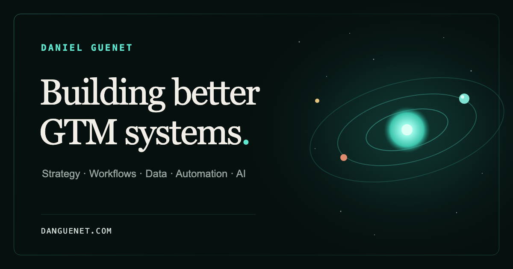

# danguenet.com

Source for [danguenet.com](https://danguenet.com), Daniel Guenet's personal website about building practical go-to-market systems.



## Stack

- [Astro](https://astro.build/) for the static site
- [Tailwind CSS](https://tailwindcss.com/) for shared design primitives
- [Motion](https://motion.dev/) for progressive animation
- Canvas for the interactive solar-system hero
- Playwright and axe-core for browser and accessibility checks

## Local development

Requirements: Node.js 22.22.2 or newer and pnpm 10.30.3.

```sh
pnpm install --frozen-lockfile
pnpm dev
```

The development server starts at `http://localhost:4321`.

## Quality checks

```sh
pnpm verify
```

The verification pipeline checks formatting, lint rules, Astro and TypeScript diagnostics, browser behavior, automated accessibility rules, and the production build. Browser tests require Chromium; install it once with:

```sh
pnpm exec playwright install chromium
```

## Useful commands

| Command                | Purpose                                                       |
| ---------------------- | ------------------------------------------------------------- |
| `pnpm dev`             | Start the local development server                            |
| `pnpm build`           | Create the production build in `dist/`                        |
| `pnpm preview`         | Preview the production build locally                          |
| `pnpm verify`          | Run formatting, linting, diagnostics, tests, and build checks |
| `pnpm assets:generate` | Regenerate PNG assets from their SVG sources                  |

## Project structure

```text
src/components/   Interactive visual components
src/layouts/      Shared document layout and metadata
src/pages/        Site routes
src/styles/       Global styles
public/           Static public assets
scripts/          Repeatable brand-asset generation
tests/            Browser and accessibility tests
```

## Deployment

`pnpm build` writes the static production site to `dist/`. The canonical production URL is configured in `astro.config.mjs`.

## License

This repository is public for reference, but it is not open source. Copyright © 2026 Daniel Guenet. All rights reserved. See [LICENSE](LICENSE) and [THIRD_PARTY_NOTICES.md](THIRD_PARTY_NOTICES.md).
